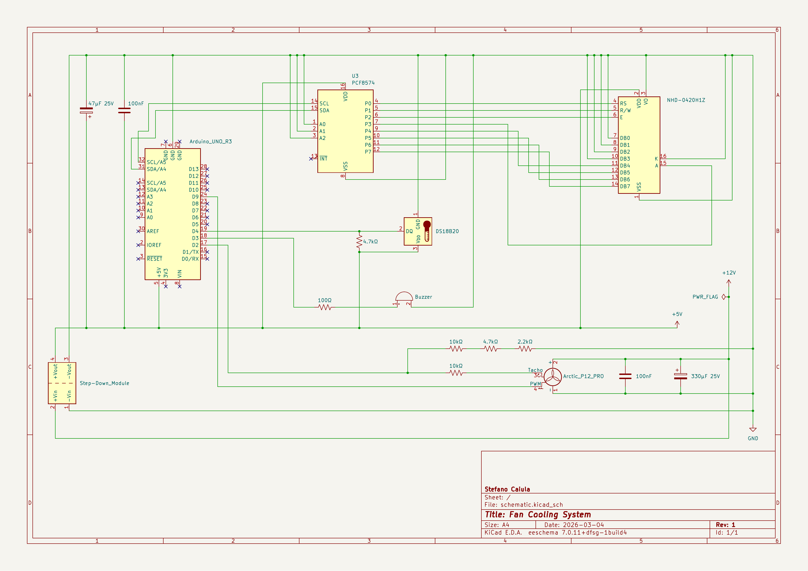

# Fan Cooling System - Bare-Metal AVR

A bare-metal C project for the ATmega328P. Implements custom 1-Wire and I2C drivers, 
PWM fan control and tachometer reading via hardware timers and interrupts. No external libraries.


## Overview

This project implements a temperature-based fan cooling system on an ATmega328P microcontroller.
A DS18B20 sensor continuously measures the ambient temperature and adjusts the fan speed accordingly
via PWM, across four operating modes: Silent, Normal, Performance and Max. The system monitors fan RPM
via tachometer input and detects faults such as fan stall, underspeed and sensor disconnection.
Errors are signaled through a 20x4 I2C LCD display, a passive buzzer and four status LEDs, each with
a dedicated alarm priority. All drivers are implemented from scratch via direct register manipulation,
using only the avr-gcc toolchain.

## Hardware

The system is built around an Arduino UNO R3 (ATmega328P) connected to a DS18B20 temperature sensor,
an Arctic P12 PRO PWM fan, a 20x4 I2C LCD display and a passive piezo buzzer. The circuit is powered
by a 12V supply with a DC-DC step-down module providing 5V to the MCU and peripherals. The fan is
driven directly at 12V. The circuit is currently assembled on a breadboard.

### Components

| **Component**             | **Quantity** | **Notes**                                      |
| :------------------------ | :----------- | :--------------------------------------------- |
| Arduino UNO R3            | 1            | ATmega328P @ 16MHz                             |
| Arctic P12 PRO            | 1            | 4-pin PWM fan, 12V                             |
| DS18B20                   | 1            | 1-Wire temperature sensor                      |
| NHD-0420H1Z               | 1            | 20x4 LCD with PCF8574 I2C module               |
| Murata Buzzer             | 1            | Passive piezo buzzer                           |
| LED                       | 4            | Red, Yellow, Blue, Green                       |
| DC-DC Step-Down Module    | 1            | 12V → 5V                                       |
| 12V Power Supply          | 1            |                                                |
| Capacitor 47µF 25V        | 1            | Electrolytic, power supply decoupling          |
| Capacitor 330µF 25V       | 1            | Electrolytic, fan power decoupling             |
| Capacitor 100nF           | 2            | Ceramic, decoupling                            |
| Resistor 4.7kΩ            | 1            | 1-Wire bus pull-up                             |
| Resistor 100Ω             | 1            | Buzzer current limiting                        |
| Resistor 220Ω             | 4            | LED current limiting                           |
| Breadboard                | 2            | 830 tie points                                 |
| Jumper Wires              | 22           |                                                |

### Schematic

The KiCad project file and a PDF export are available in the `hardware/` folder.



## Software

The firmware is organized into independent, single-responsibility modules. Each peripheral has a dedicated
driver with a clean public interface, keeping hardware-specific code separate from application logic.

### Structure

| **File**                    | **Description**                                                                 |
| :-------------------------- | :------------------------------------------------------------------------------ |
| src/main.c                  | System initialization, main control loop, fault detection and alarm management  |
| src/fan.c                   | Arctic P12 PRO driver: 25kHz PWM, tachometer RPM sampling, fault detection      |
| src/lcd.c                   | NHD-0420H1Z driver: TWI/I2C state machine, 4-bit mode, cursor control, print    |
| src/temp_sensor.c           | DS18B20 driver: 1-Wire protocol, non-blocking temperature conversion            |
| src/buzzer.c                | Passive buzzer driver: CTC tone generation, continuous and intermittent alarms  |
| src/led.c                   | LED status indicator driver: four-color fault signaling                         |
| src/system_timer.c          | Timer0 CTC driver: 1ms interrupt-driven timekeeping via get_millis()            |
| include/fan.h               | Fan status enum, ICR1 value, public driver interface                            |
| include/lcd.h               | TWI states, PCF8574 address, LCD commands, public driver interface              |
| include/temp_sensor.h       | DS18B20 commands, error sentinel, public driver interface                       |
| include/buzzer.h            | OCR2A value formula, public driver interface                                    |
| include/led.h               | LED color enum, public driver interface                                         |
| include/system_timer.h      | OCR0A value, system_millis extern, public driver interface                      |
| include/board.h             | Hardware pin definitions and CPU frequency for Arduino UNO R3                   |
| include/config.h            | System configuration parameters: temperature thresholds and fan speeds          |
| Makefile                    | Build system: compile, flash and memory usage targets                           |

### Drivers and Communication Protocols  

The following section describes the drivers and communication protocols implemented 
in this project and the key implementation decisions.

#### Temperature Sensor - DS18B20 (1-Wire)

* **Reset and Presence Pulse:** Every communication starts with a 480µs reset pulse,
during which the master pulls the bus LOW. After release, the master samples at 70µs. 
The datasheet specifies that the sensor waits 15-60µs before pulling the bus LOW for 60-240µs. 
Sampling at 70µs ensures the presence pulse is detected for both fast sensors (15µs delay) 
and slow sensors (60µs delay), covering the full guaranteed window.
* **Write and Read Slots:** In a Write 1 slot the master pulls the bus LOW and releases
it within 15µs. The bus is pulled HIGH by the resistor for the remainder of the slot.
Holding for 10µs ensures the sensor detects the start but samples a HIGH state. In a
Write 0 slot the master holds the bus LOW for the full slot duration (minimum 60µs).
Holding for 55-60µs ensures the sensor samples a LOW state during its 15-60µs sampling
window. For Read slots, the master initiates with a 2µs LOW pulse, releases the bus and
samples at 12µs total from the falling edge, within the 15µs datasheet limit, providing
a safe margin.
* **Asynchronous Conversion:** The DS18B20 takes up to 750ms for a 12-bit conversion.
Instead of blocking the system with `_delay_ms(750)`, `get_raw_temperature()` implements
a two-state FSM using `get_millis()` to check elapsed time without occupying the CPU,
keeping the main loop responsive during conversion.

#### LCD - NHD-0420H1Z via PCF8574 (I2C)

* **Interrupt-Driven State Machine:** The TWI peripheral is driven by an ISR that manages
the I2C master transmitter state machine. Each transmission is triggered by writing to
TWCR with the START condition bit set. The ISR handles address transmission, data
transmission, NACK detection and bus release via STOP condition, setting `twi_busy = 0`
when complete. A timeout of 10ms in `twi_send()` prevents the system from blocking
indefinitely if the bus becomes unresponsive.

* **Bus Release Time:** After each STOP condition, a minimum delay of 50µs is required
before issuing a new START condition. Without this delay, the PCF8574 fails to
acknowledge the second transmission onward, causing `lcd_init()` to return an error.
This was identified during hardware testing and resolved by adding `_delay_us(50)` in
`twi_send()` after the bus-free check.

* **4-Bit Mode and EN Pulse:** Each byte is split into two nibbles, high nibble first,
then low nibble. For each nibble, two I2C bytes are sent: one with the EN pin HIGH to
latch the data, and one with EN LOW to complete the latch. The PCF8574 maps its 8 output
pins directly to the LCD control and data lines: P0=RS, P1=RW (always LOW), P2=EN,
P3=BL (backlight), P4-P7=DB4-DB7.

* **Initialization Sequence:** The LCD requires three wake-up nibbles (0x03) with
specific delays (>4.1ms, >100µs) before switching to 4-bit mode. This sequence is
mandatory, without it the controller does not correctly interpret subsequent commands.

* **Character Overflow Handling:** `lcd_print()` does not check the string length
before printing. A potential overflow would write to DDRAM beyond the last visible
character, but the NHD-0420H1Z has 40 DDRAM cells per row with non-contiguous
addresses between rows, so an overflow on one row does not corrupt the adjacent row.
All strings passed to `lcd_print()` are padded with trailing spaces to overwrite any
residual characters from previous prints, avoiding visual artifacts without calling
`LCD_CLEAR_DISPLAY` on every cycle, which would cause visible flickering due to the
1.52ms execution time of the clear command.

#### Fan - Arctic P12 PRO (PWM and Tachometer)

* **25kHz PWM Frequency:** Timer 1 is configured in Fast PWM mode 14 with ICR1 as TOP,
giving a frequency of 16MHz / 640 = 25kHz. This frequency follows the Intel 4-wire fan
specification and is above the audible range, ensuring silent operation at all duty
cycles. Fan speed is set by writing the duty cycle percentage (0-100) to OCR1A:
`OCR1A = (ICR1 * duty_cycle) / 100`.

* **RPM Sampling:** Tachometer pulses are counted by an INT0 ISR on the falling edge of
the tacho signal. `fan_get_rpm()` samples the pulse count every 1 second, calculates
RPM as `(elapsed_pulses / 2) * 60` (2 pulses per revolution), and returns the last
valid value between samples to keep the display stable.

* **Tachometer Pull-Up:** The Arctic P12 PRO tacho signal is open-collector. Without a
pull-up the pin floats and INT0 never triggers, resulting in RPM = 0. The ATmega328P
internal pull-up (~50kΩ) is enabled on the tacho pin via `PORTD |= (1 << FAN_TACHO)`,
providing a sufficient pull-up for the tachometer signal without external components.

* **Fault Detection:** `fan_get_status()` detects two fault conditions: stall (RPM = 0
with active PWM) and underspeed (RPM below the expected threshold calculated from duty
cycle, nominal RPM per duty unit and a configurable tolerance percentage). Both
thresholds are configurable in `config.h`.

#### Buzzer - Murata Passive Piezo

* **CTC Tone Generation:** Timer 2 is configured in CTC mode to toggle OC2B (D3) on
compare match, generating a square wave at the target frequency. The compare value is
calculated as `OCR2A = (F_CPU / (2 * 64 * BUZZER_FREQ_HZ)) - 1`, where 64 is the
prescaler. At 2000Hz this gives OCR2A = 61, within the 8-bit range.

* **Continuous and Intermittent Alarms:** Two alarm modes are implemented. 
`buzzer_alarm_critical()` starts a continuous tone and locks it on until system reset,
subsequent calls are no-ops. `buzzer_alarm_warning()` implements a non-blocking
intermittent tone using `get_millis()` to alternate between on and off states based on
`BUZZER_BLINK_ON_MS` and `BUZZER_BLINK_OFF_MS` intervals defined in `config.h`.

* **Timer Reset Before Reconfiguration:** `buzzer_set_tone()` resets TCCR2A and TCCR2B
to 0 before reconfiguring Timer 2. Without this reset, residual timer state from a
previous `buzzer_alarm_critical()` call prevents the intermittent alarm from restarting
correctly after the critical alarm is cleared.

#### LED Status Indicators

* **Color-to-Fault Mapping:** Four LEDs on PB2-PB5 provide a visual summary of system
status: GREEN = all peripherals OK, YELLOW = sensor fault, RED = fan fault, BLUE = LCD
fault. At most one LED is active at any time, reflecting the highest-priority fault
currently detected.

* **Fault Priority:** RED and YELLOW take precedence over BLUE. When a critical fault
clears, the GREEN LED turns on and all others are turned off.

#### System Timer

`system_millis` is a `uint32_t`, which can hold values up to 2³²-1 = 4,294,967,295. Since it is incremented every millisecond by the
Timer0 ISR, it overflows after approximately 49.7 days:

$$\frac{2^{32} \text{ ms}}{\left( 1000 \frac{\text{ms}}{\text{s}} \cdot 60 \frac{\text{s}}{\text{min}} \cdot 60 \frac{\text{min}}{\text{h}} \cdot 24 \frac{\text{h}}{\text{d}} \right)} = \frac{4\,294\,967\,296 \text{ ms}}{86\,400\,000 \text{ ms/d}} \approx 49,7 \text{ d}$$

When overflow occurs, `system_millis` wraps back to 0. All elapsed-time checks in the codebase use the subtraction pattern
`current_time - last_time >= interval`, which is safe across overflow boundaries due to unsigned integer wraparound: if
`current_time` wraps to a value smaller than `last_time`, the subtraction underflows to the correct positive difference in modular
arithmetic. No special handling is therefore required.

### Error Handling

The system monitors four fault conditions and signals them through dedicated LEDs and
buzzer alarms. Faults are evaluated every main loop cycle and are mutually exclusive by
priority, sensor and fan faults take precedence over LCD and LED faults, preventing
lower-priority alarms from interfering with critical ones.

| **Fault**      | **Detection**                      | **LED**  | **Buzzer**   | **Fan**   |
| :------------- | :--------------------------------- | :------- | :----------- | :-------- |
| Sensor error   | `TEMP_SENSOR_ERROR` sentinel value | YELLOW   | Continuous   | MAX speed |
| Fan stall      | RPM = 0 with active PWM            | RED      | Continuous   | —         |
| Fan underspeed | RPM below duty cycle threshold     | RED      | Continuous   | —         |
| LCD fault      | TWI timeout or NACK                | BLUE     | Intermittent | —         |
| LED fault      | Invalid enum argument              | —        | Intermittent | —         |

In safe mode, the fan is forced to MAX speed as a fail-safe measure: without a valid 
temperature reading, the system cannot determine the appropriate fan speed, so maximum 
cooling is applied to prevent overheating.

When all faults are cleared, the GREEN LED turns on and `buzzer_stop()` is called to
silence any active alarm.

### Critical Sections

* **Atomic 32-bit Read:** `system_millis` is a `uint32_t` updated by the Timer0 ISR
every 1ms. On an 8-bit architecture, reading a 32-bit variable requires 4 CPU cycles.
If the ISR fires mid-read, the value would be corrupted. `get_millis()` disables
interrupts with `cli()` for the duration of the read and re-enables them immediately
after with `sei()`.

* **1-Wire Timing Protection:** The 1-Wire protocol requires microsecond-level timing
precision. Any interrupt during a bit slot would corrupt the communication. `cli()` is
called at the start of every timing-critical operation (`sensor_reset()`,
`sensor_write_bit()`, `sensor_read_bit()`) and `sei()` is called immediately after,
keeping the critical section as short as possible.

### Problems and Resolutions

#### Blocking Delay During Temperature Conversion
Initially `get_raw_temperature()` used `_delay_ms(750)` to wait for the DS18B20
conversion, blocking the entire system for 750ms each cycle. As a solution, a two-state
FSM was implemented using `get_millis()` to check the elapsed time without occupying
the CPU, keeping the main loop responsive during conversion and ensuring all other
drivers continue to run normally.

#### False FAN_ERROR_STALL at Startup
At startup, `fan_get_rpm()` returns 0 for the first second because no tachometer sample
has been completed yet. With any active duty cycle, `fan_get_status()` would immediately
detect a stall condition and trigger the critical alarm. As a solution, a blocking wait
of 1 second is added after `sei()` in `main.c`:
```c
while (get_millis() < 1000);
```

This ensures the first RPM sample is ready before the main loop starts evaluating fan
status. Interrupts remain active during this wait, so all drivers continue to operate
normally.

#### I2C Bus Release Time
During hardware testing, `lcd_init()` consistently failed after the first nibble
transmission. The issue was identified in `twi_send()`, after each STOP condition
a new START was issued immediately without waiting for the bus to be released. The
PCF8574 requires a minimum settling time between STOP and the next START before it
can acknowledge a new transmission. As a solution, a `_delay_us(50)` was added in
`twi_send()` after the bus-free check, which resolved the issue completely.

#### Buzzer Warning Silenced After Critical Alarm
When the system transitions from a critical fault (sensor error or fan fault) to a
lower-priority fault (LCD error), `buzzer_alarm_warning()` is called with `buzzer_status`
still set to 1 from the previous `buzzer_alarm_critical()` call. The warning function
interprets this as an active tone and immediately calls `buzzer_stop()`, silencing the
buzzer without restarting the intermittent alarm. As a solution, `buzzer_set_tone()`
was modified to reset TCCR2A and TCCR2B to 0 before reconfiguring Timer 2, ensuring a
clean state regardless of the previous alarm mode.

#### LCD Flickering on Fan Fault
When a fan fault is detected, the main loop writes "FAN OK" to LCD row 2 inside the
temperature range blocks, then immediately overwrites it with the fault message inside
the fan error blocks. This double write on the same row every cycle causes visible
flickering. As a solution, the "FAN OK" print was moved inside a `if (fan_status == FAN_OK)`
check within each temperature range block, so row 2 is written only once per cycle
regardless of fan status.

### Known Limitations and Future Improvements

* **No hysteresis on temperature thresholds:** Rapid temperature fluctuations near a
threshold boundary may cause frequent fan speed changes. A hysteresis band around each
threshold would prevent this behavior and is planned for a future revision.

* **No fan-off mode for low temperatures:** The fan runs at minimum speed (30% duty
cycle) even at low temperatures. A fan-off mode with safe restart logic, ensuring the
fan reaches a stable speed before enabling fault detection, is planned for a future
revision.

* **No thermal protection on fan fault:** When a fan fault is detected, the system 
signals the error but has no hardware fallback to prevent overheating. In a production 
environment, a thermal shutdown or an emergency power-off mechanism should be considered.

### Installation and Usage

The following instructions are tested on Linux. See the Makefile comments for macOS and
Windows adjustments.

#### Prerequisites
The following tools are required: `avr-gcc`, `avr-libc` and `avrdude`.

On Debian-based systems:
```bash
sudo apt install gcc-avr avr-libc avrdude
```

#### Clone and Build
```bash
git clone https://github.com/steve-caiula/Fan-Cooling-System.git
cd Fan-Cooling-System
make
```

After a successful build, memory usage is printed automatically:
```
Program:    5302 bytes (16.2% Full)
Data:        297 bytes (14.5% Full)
```

#### Flash
Verify that the `PORT` variable in the Makefile matches your system before flashing.
Then run:
```bash
make flash
```

To remove build artifacts:
```bash
make clean
```

#### Configuration
System parameters such as temperature thresholds and fan speeds can be adjusted in
`include/config.h` without modifying the driver code.

#### Usage
At startup the system waits 1 second for the first fan RPM sample, then enters the
main control loop. The LCD displays the current temperature and fan speed mode. If a
fault is detected, the corresponding LED turns on and the buzzer activates. The system
recovers automatically when the fault is cleared, except for fan stall and underspeed
which require a system reset.

## References

* [ATmega328P Datasheet](https://ww1.microchip.com/downloads/en/DeviceDoc/Atmel-7810-Automotive-Microcontrollers-ATmega328P_Datasheet.pdf)
* [DS18B20 Datasheet](https://www.analog.com/media/en/technical-documentation/data-sheets/DS18B20.pdf)
* [NHD-0420H1Z Datasheet](https://newhavendisplay.com/content/specs/NHD-0420H1Z-FSW-GBW-33V3.pdf)
* [PCF8574 Datasheet](https://www.nxp.com/docs/en/data-sheet/PCF8574_PCF8574A.pdf)
* [4-Wire PWM Fan Specification](https://glkinst.com/cables/cable_pics/4_Wire_PWM_Spec.pdf)
* [Arctic P12 PRO Documentation](https://support.arctic.de/p12-pro/docs)
* [Murata PKM22EPPH4001-B0 Datasheet](https://www.arduino.cc/documents/datasheets/PIEZO-PKM22EPPH4001-BO.pdf)
* [Arduino UNO R3 Pinout](https://docs.arduino.cc/resources/pinouts/A000066-full-pinout.pdf)

## Author

Stefano Caiula
* [GitHub](https://github.com/steve-caiula)
* [LinkedIn](https://www.linkedin.com/in/stefano-c-a76137258/)